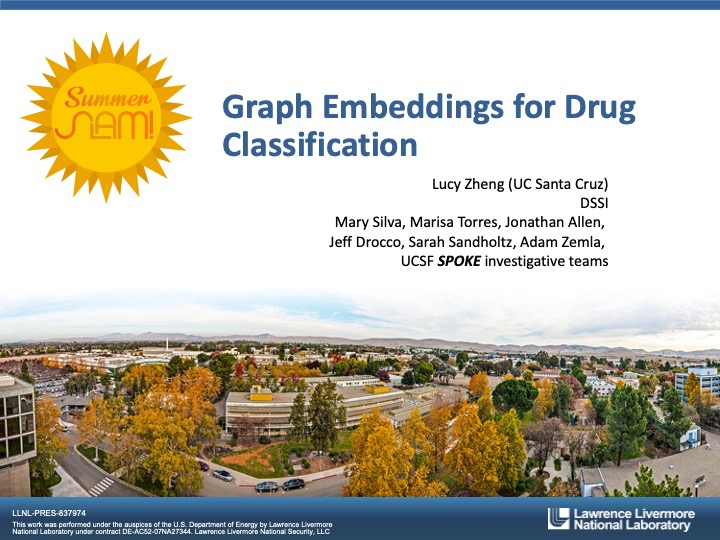
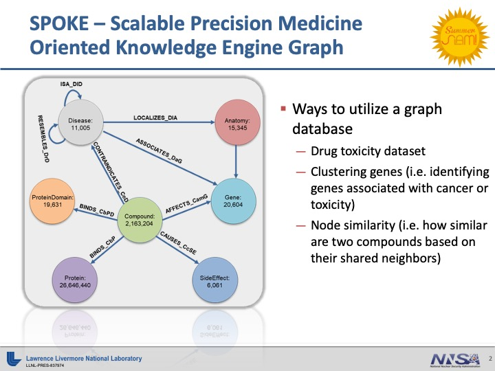
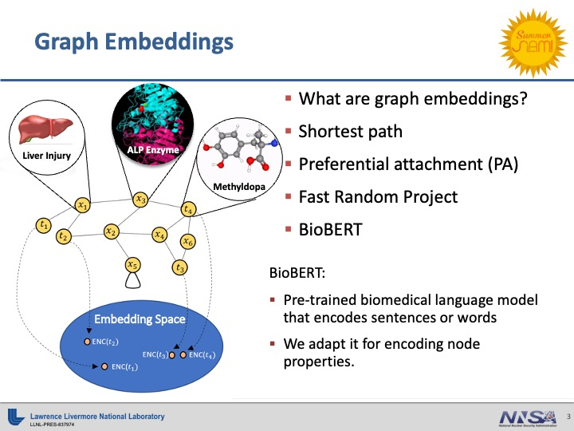
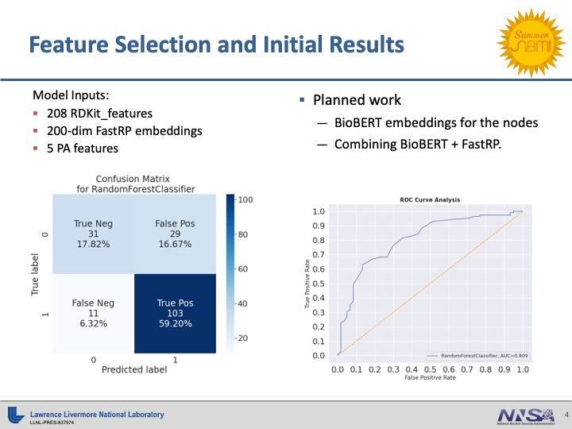
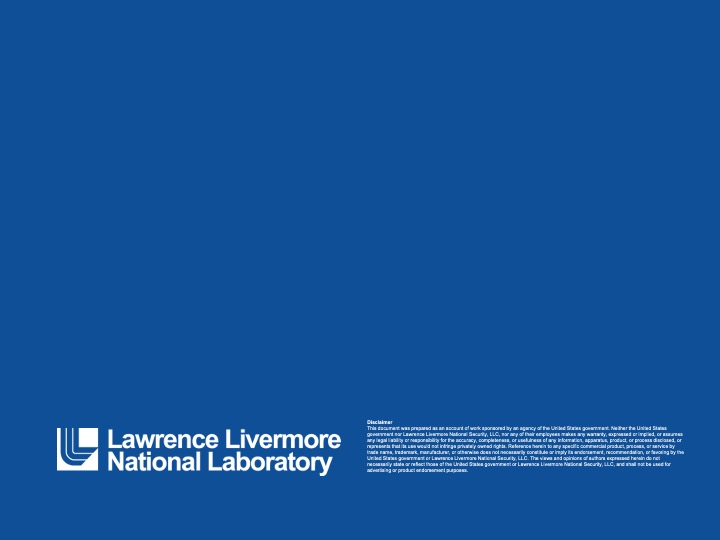
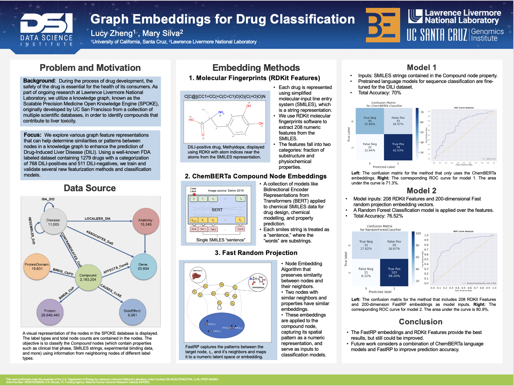

# Graph-Embeddings
Graph Embeddings for Drug Classification

Over the past summer, I interned at the Lawrence Livermore National Laboratory (LLNL) where I focused on exploring three graph embeddings to improve the prediction accuracy of the random forest classification model. This classification model predicts whether or not specific compounds contribute to liver toxicity. We used the UC San Francisco's SPOKE (Scalable Precision Medicine Oriented Knowledge Engine Graph) database which contains relationships between different components such as diseases, genes, and compounds. Halfway through my internship, I presented at the annual LLNL Summer Slam with the current project that I was doing. 

Through this experience, I learned how to share my research project towards a general audience that is engaging and comprehensive. As I explore the three main graph embeddings methods and reach towards the end of my internship, I submitted my summer research abstract for the annual SACNAS Conference. I was able to present a poster of the research and share it with a diverse audience of scientists.

